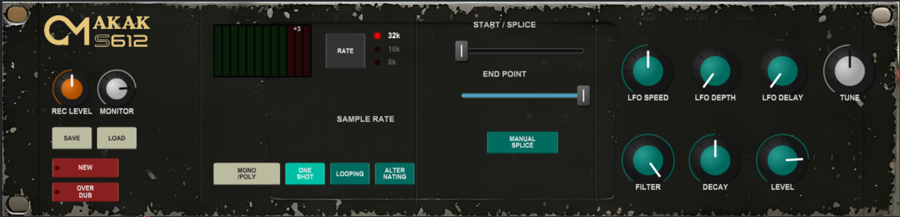

# CIRCAT AKAKS6I2 V1 - Official Plugin Distribution

A faithful 12-bit hardware emulation of the legendary **Akai S612 Digital Sampler** (1985). This VST3 plugin captures the gritty character, unique workflow, and characterful resampling of the original rack unit.

## ✨ Features

- **CIRCAT V1 Engine:** Authentic 12-bit depth and character floor.
- **Variable Sample Rates:** Characterful 32kHz, 16kHz, and 8kHz operation modes.
- **Hardware-Style Loop Controls:** Manual Splice, Alternating Loop (Hin & Her), and iconic faders.
- **MIDI Learn:** Ready for hardware mapping.
- **Safety Hard-Guard:** Built-in warm-up protection to prevent initialization glitches and audio spikes.

## 📦 What's Included

- **`CIRCAT AKAKS6I2 V1.vst3`**: The core plugin bundle (Windows x64).
- **`MANUAL.md`**: Official User Manual with detailed control descriptions.
- **`README.md`**: This distribution overview.
- **`Circat_AKAKS6I2_Screenshot.PNG`**: High-resolution interface preview.

## 🚀 Installation

1.  Download the **`CIRCAT_AKAKS6I2_V1_VST3_X64.zip`** from the [Releases](https://github.com/circat/S612-Sampler-VST3/releases) page.
2.  Extract the ZIP content.
3.  Copy the **`CIRCAT AKAKS6I2 V1.vst3`** folder/bundle into your VST3 folder:
    - **Windows:** `C:\Program Files\Common Files\VST3\`
4.  Restart your DAW and rescan plug-ins.

## 🛠 Usage & Manual
Please refer to the [User Manual (MANUAL.md)](MANUAL.md) for a full breakdown of the front panel, recording modes, and modulation options.

---
*Created by [CIRCAT.MEDIA](https://circat.media). Digital Vintage Engineering.*
